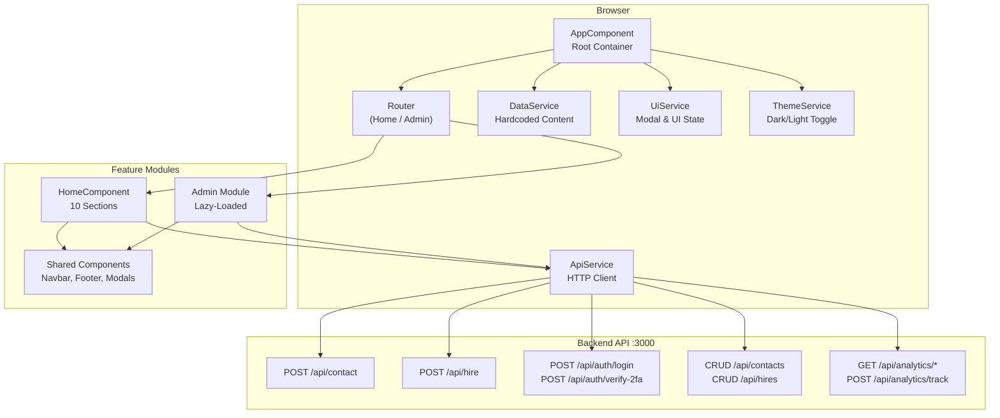
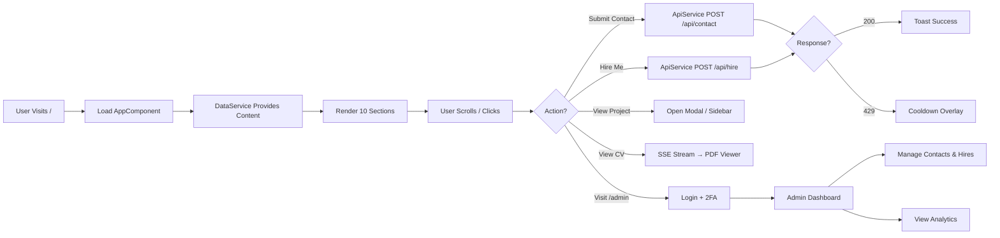
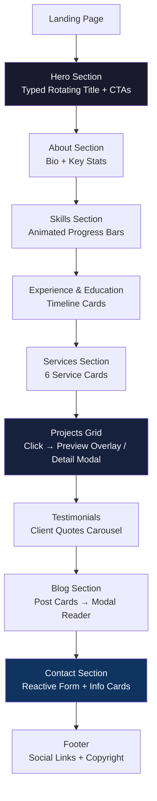

# 🌐 Personal Portfolio Frontend

> A modern, responsive Angular portfolio showcasing projects, skills, and professional experience — with a full admin dashboard for managing inquiries and analytics.

[](https://angular.dev/)
[](https://www.typescriptlang.org/)
[](https://sass-lang.com/)
[](LICENSE)
[]()

---

## 📌 Project Overview

This project is a **professional single-page portfolio website** built with Angular 17 standalone components. It serves as a digital resume and project showcase for a frontend developer specializing in **Angular, React, and modern web technologies**.

### Key Goals

| Goal | Description |
|------|-------------|
| **Showcase Work** | Present projects with detailed architecture, tech stacks, and live previews |
| **Demonstrate Skill** | Highlight technical expertise through clean code, animations, and responsive design |
| **Enable Contact** | Provide multiple channels for inquiries — contact form, hire requests, WhatsApp, LinkedIn |
| **Admin Management** | Full backend dashboard for managing submissions, tracking analytics, and monitoring visits |

---

## 🚀 What's New (Project Update)

### ✨ New Features
- **Admin Dashboard** — Full CRUD management for contact form submissions and hire requests with status tracking
- **Real-Time Analytics** — Live visitor count, daily/monthly stats, and visitor logs with 15-second polling
- **Project Documentation Sidebar** — Slide-out panel with architecture diagrams, tech stacks, and methodology for each showcased project
- **CV PDF Viewer** — Server-sent events (SSE) powered CV/resume viewer with progress tracking
- **Upwork Integration Widget** — Floating quick-access widget linking to Upwork profile and service listings
- **Two-Factor Authentication (2FA)** — Secure admin login with email-based OTP verification

### 🛠️ Improvements
- **Theme Persistence** — Dark/light mode now saved to `localStorage` with seamless transitions via CSS custom properties
- **Rate Limiting Protection** — Cooldown overlay with animated countdown shields the UI on 429 responses
- **Toast Notification Queue** — Multi-notification support with auto-dismiss progress bars
- **Scroll-Spy Navigation** — `IntersectionObserver`-based active link highlighting across all 10 sections
- **Skill Bar Animations** — IntersectionObserver-triggered animated progress bars for visual impact

### 🐛 Bug Fixes
- Fixed modal z-index stacking conflicts on mobile viewports
- Resolved SSR compatibility warnings with `isPlatformBrowser` guards
- Corrected scroll-lock behavior when multiple modals are open simultaneously

---

## 🏗️ Project Architecture

The application follows a **modular feature-based architecture** using Angular 17 standalone components (no NgModules).



### Architectural Principles

| Principle | Implementation |
|-----------|---------------|
| **Standalone Components** | Every component is `standalone: true` — no NgModules |
| **Single Data Source** | `DataService` holds all portfolio content as a typed `SiteData` object |
| **Reactive State** | `BehaviorSubject` streams in `UiService` for modal/UI state; Angular Signals in `CooldownService` |
| **Lazy Loading** | Admin module lazy-loaded only when `/admin` route is accessed |
| **Guarded Routes** | `authGuard` + JWT validation protect admin dashboard routes |

---

## 📂 Folder Structure

```
personal-portfolio-frontend/
├── src/
│   ├── app/
│   │   ├── core/                    # 🏛️ Core services (singletons)
│   │   │   └── services/
│   │   │       ├── api.service.ts           # Public API client
│   │   │       ├── admin-api.service.ts     # Authenticated admin API
│   │   │       ├── data.service.ts          # Hardcoded portfolio content
│   │   │       ├── theme.service.ts         # Dark/light theme manager
│   │   │       ├── ui.service.ts            # Modal & UI state streams
│   │   │       ├── toast.service.ts         # Notification queue
│   │   │       └── cooldown.service.ts      # Rate-limit countdown
│   │   ├── features/                # 📄 Page-level components
│   │   │   ├── home/                # Main portfolio SPA (10 sections)
│   │   │   └── cv-viewer/           # PDF CV viewer via SSE
│   │   ├── admin/                   # 🔐 Admin dashboard module
│   │   │   ├── login/               # Login + 2FA verification
│   │   │   ├── layout/              # Admin sidebar layout
│   │   │   ├── contacts/            # Contact submissions CRUD
│   │   │   ├── hires/               # Hire requests CRUD
│   │   │   ├── analytics/           # Real-time stats dashboard
│   │   │   ├── guards/auth.guard.ts # JWT route protection
│   │   │   └── interceptors/        # Bearer token attachment
│   │   ├── shared/                  # ♻️ Reusable components
│   │   │   └── components/
│   │   │       ├── navbar/                  # Fixed top navigation
│   │   │       ├── mobile-menu/             # Responsive dropdown
│   │   │       ├── footer/                  # Site footer
│   │   │       ├── modals/                  # Project, blog, hire, preview modals
│   │   │       ├── toast/                   # Notification renderer
│   │   │       ├── cooldown-overlay/        # Rate-limit blocker
│   │   │       ├── admin-panel-strip/       # Side analytics panel
│   │   │       └── portfolio-project-sidebar/ # Architecture docs drawer
│   │   ├── app.routes.ts            # Route definitions
│   │   ├── app.config.ts            # App configuration & providers
│   │   └── app.component.ts         # Root component
│   ├── assets/                      # Static files (images, CV PDF)
│   ├── styles.scss                  # Global SCSS + CSS custom properties
│   ├── index.html                   # Entry HTML
│   └── main.ts                      # Bootstrap file
├── proxy.conf.json                  # Dev proxy to backend API
├── angular.json                     # Angular CLI configuration
├── package.json                     # Dependencies & scripts
└── tsconfig.json                    # TypeScript configuration
```

---

## 🔄 Application Flow



### Step-by-Step Flow

1. **Entry** → User lands on `/`, Angular bootstraps `AppComponent`
2. **Data Init** → `DataService` injects hardcoded `SiteData` into all child components
3. **Theme Check** → `ThemeService.initTheme()` reads `localStorage` and applies class
4. **Render** → `HomeComponent` renders 10 scrollable sections with content
5. **Interaction** → User fills contact/hire form → `ApiService` POSTs to backend
6. **Response** → Success triggers toast; 429 triggers cooldown overlay
7. **Admin Access** → Navigate to `/admin` → login with credentials → 2FA OTP → JWT stored
8. **Dashboard** → Authenticated admin manages submissions and views analytics (polls every 15s)

---

## 📊 Data Flow / Process Visualization

### Contact Form Submission

```mermaid
sequenceDiagram
    participant User
    component HomeComponent
    component ApiService
    participant Backend API
    component ToastService
    component CooldownService

    User->>HomeComponent: Fills contact form
    User->>HomeComponent: Clicks "Send Message"
    HomeComponent->>ApiService: submitContact(data)
    ApiService->>Backend API: POST /api/contact
    alt Success (200)
        Backend API-->>ApiService: 200 OK
        ApiService->>ToastService: enqueue(success)
        ToastService-->>User: "Message sent!"
        HomeComponent->>HomeComponent: Reset form
    else Rate Limited (429)
        Backend API-->>ApiService: 429 Too Many Requests
        ApiService->>CooldownService: activate(duration)
        CooldownService-->>User: Full-screen overlay with countdown
    else Error (5xx)
        Backend API-->>ApiService: 500 Internal Server Error
        ApiService->>ToastService: enqueue(error)
        ToastService-->>User: "Server error. Try again later."
    end
```

### Admin Authentication Flow

```mermaid
sequenceDiagram
    participant Admin
    component LoginComponent
    component AdminApiService
    participant Backend API
    component AuthGuard

    Admin->>LoginComponent: Enters username + password
    LoginComponent->>AdminApiService: login(credentials)
    AdminApiService->>Backend API: POST /api/auth/login
    Backend API-->>AdminApiService: { requires2FA: true }
    LoginComponent->>Admin: SweetAlert2 modal: Enter 6-digit OTP
    Admin->>LoginComponent: Submits OTP
    LoginComponent->>AdminApiService: verify2fa(username, code)
    AdminApiService->>Backend API: POST /api/auth/verify-2fa
    Backend API-->>AdminApiService: { token, expiresIn }
    AdminApiService->>LoginComponent: Store JWT in localStorage
    LoginComponent->>AuthGuard: Navigate to /admin/dashboard
    AuthGuard->>AuthGuard: Validate token + expiry
    AuthGuard-->>LoginComponent: Access granted
```

---

## 🖥️ UI/UX Flow



### UX Best Practices Applied

| Practice | Implementation |
|----------|---------------|
| **Progressive Disclosure** | Project details hidden behind click → modal; full architecture docs in slide-out sidebar |
| **Responsive Design** | Mobile menu dropdown for `<1024px`; fluid grids; touch-friendly targets |
| **Scroll Affordances** | Scroll progress bar, scroll-to-top button, nav arrows for sequential section navigation |
| **Feedback Loops** | Toast notifications for all form submissions; loading states; cooldown overlay for rate limits |
| **Accessibility** | Semantic HTML, `aria-labels` on interactive elements, keyboard-navigable modals |
| **Performance** | Lazy-loaded admin module; `IntersectionObserver` for animations; budget warnings in `angular.json` |

---

## ⚙️ Installation & Setup

### Prerequisites

| Tool | Minimum Version |
|------|----------------|
| [Node.js](https://nodejs.org/) | 18.x+ |
| [npm](https://www.npmjs.com/) | 9.x+ |
| [Angular CLI](https://angular.dev/tools/cli) | 17.x+ |

### Quick Start

```bash
# 1. Clone the repository
git clone https://github.com/muzzamil7770/personal-portfolio-frontend
cd personal-portfolio-frontend

# 2. Install dependencies
npm install

# 3. Start the development server
npm start

# 4. Open in browser
# → http://localhost:4200
```

### Available Scripts

| Command | Description |
|---------|-------------|
| `npm start` | Launch dev server with auto-open and proxy |
| `npm run build` | Production build with optimizations |
| `npm run watch` | Incremental dev build for rapid iteration |
| `npm test` | Run unit tests with Karma |
| `ng serve --configuration production` | Serve production-like build locally |

### Backend Dependency

This frontend requires a **backend API server** running on `http://localhost:3000/api`. Configure the target URL via [`proxy.conf.json`](proxy.conf.json) or update the `ApiService` / `AdminApiService` base URLs for production deployments.

> **Tip:** Ensure your backend implements the expected endpoints: `/api/contact`, `/api/hire`, `/api/auth/login`, `/api/auth/verify-2fa`, `/api/contacts/*`, `/api/hires/*`, `/api/analytics/*`, and `/api/cv/base64`.

---

## 🧪 Usage

### Building for Production

```bash
ng build --configuration production
```

Output is written to `dist/portfolio/` with hashed filenames and optimized assets.

### Deploying the Build

Copy the contents of `dist/portfolio/` to any static hosting service:

| Service | Command |
|---------|---------|
| **Netlify** | `netlify deploy --dir=dist/portfolio --prod` |
| **Vercel** | `vercel --prod` |
| **GitHub Pages** | `ng build --base-hrepo-name --output-path docs && git push` |
| **Nginx** | Copy to `/var/www/portfolio/` and configure server block |

### Admin Login

1. Navigate to `http://localhost:4200/admin`
2. Enter your admin username and password
3. Complete 2FA verification via the OTP sent to your email
4. Access the dashboard to manage contacts, hires, and view analytics

---

## 📈 Future Improvements

| Area | Planned Enhancement |
|------|--------------------|
| **Content Management** | Replace hardcoded `DataService` with a headless CMS (Sanity, Contentful, or Strapi) |
| **SSR / SSG** | Enable Angular Universal or Angular 17 SSR for improved SEO and initial load |
| **i18n** | Add multi-language support via Angular's `@angular/localize` |
| **Image Optimization** | Lazy-load images with `loading="lazy"` and WebP fallback |
| **E2E Testing** | Add Cypress or Playwright integration tests for critical user flows |
| **PWA** | Convert to Progressive Web App with service worker and offline support |
| **CI/CD** | GitHub Actions workflow for automated build, test, and deploy on push |
| **Scalability** | Introduce NgRx or SignalStore for complex state management as features grow |

---

## 🤝 Contribution Guide

Contributions are welcome! Follow these steps:

```bash
# 1. Fork the repository
# 2. Create a feature branch
git checkout -b feature/your-feature-name

# 3. Make your changes
# 4. Run tests and lint
ng test
ng lint

# 5. Commit with a descriptive message
git commit -m "feat: add dark mode animation transition"

# 6. Push and open a Pull Request
git push origin feature/your-feature-name
```

### Coding Standards

- Use **standalone components** (no NgModules)
- Follow **Angular style guide** — descriptive names, `*` suffix for services
- Prefer **Signals** over `BehaviorSubject` for new state
- Use **SCSS** with nesting; leverage CSS custom properties for theming
- Write **type-safe** code — avoid `any`

---

## 📄 License

This project is licensed under the [MIT License](LICENSE).

---

<p align="center">
  <sub>Built with ❤️ using Angular 17</sub>
</p>
