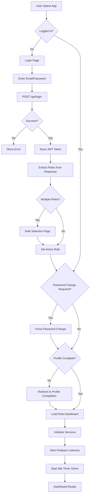

# PathWays - Healthcare Practice Management Platform

> A comprehensive, role-based healthcare practice management platform for mental health and therapy practices. Built with Angular 19, featuring appointment scheduling, claims management, clinical notes, billing, and real-time notifications.

<div align="center">


*PathWays Healthcare Practice Management Platform*

</div>

---

<div align="center">


*Comprehensive Practice Management Tools*

</div>

---

## 📋 Table of Contents

- [Overview](#overview)
- [Key Features](#key-features)
- [Tech Stack](#tech-stack)
- [Architecture](#architecture)
- [Application Flow](#application-flow)
- [Role-Based Access](#role-based-access)
- [API Integration](#api-integration)
- [Best Practices](#best-practices)
- [Getting Started](#getting-started)
- [Development](#development)
- [Building for Production](#building-for-production)
- [Testing](#testing)
- [Deployment](#deployment)
- [Project Structure](#project-structure)
- [Environment Configuration](#environment-configuration)
- [State Management](#state-management)
- [Contributing](#contributing)
- [License](#license)

---

## 🎯 Overview

**PathWays** is an enterprise-grade healthcare practice management platform designed for mental health and therapy practices. It provides a unified solution for managing appointments, clinical notes, insurance claims, billing, patient onboarding, and team coordination across six distinct user roles.

### What It Does

- **Providers/Clinicians**: Manage appointments, track clinical notes, view practice metrics, and monitor patient progress
- **Billers**: Handle insurance claims, invoices, balance tracking, and verification of benefits (VOB)
- **Schedulers**: Coordinate appointments, manage clinician availability, handle patient onboarding
- **Training & Hiring**: Trainee management with separate dashboards and metrics
- **Operational Directors**: Full administrative control over users, locations, insurance providers, and system-wide reporting
- **Patients**: Personal dashboard for appointment history, documents, forms, and invoices

---

## ✨ Key Features

### 📅 Appointment Management
- Full calendar view with drag-and-drop scheduling
- Appointment lifecycle: requested → pending → show → completed/cancelled/no-show
- Appointment approval workflows
- Recurring appointments with RRULE support
- Room/location-based booking
- Real-time availability management
- Late cancellation and no-show handling with automated billing ($75 fee)

### 💰 Claims & Billing
- Insurance claim submission and tracking pipeline
- Claims dashboard (submitted vs. not-submitted)
- Invoice generation with PDF viewing
- Patient balance tracking and reporting
- Verification of Benefits (VOB) status tracking
- Headway integration for billing workflows

### 👥 Patient Management
- Comprehensive patient profiles with insurance, caregivers, and dependents
- Patient onboarding workflows
- Document upload/download/streaming
- Pre-assessment form management (15+ categories)
- Patient waitlist management
- Caregiver/dependent relationships

### 📊 Analytics & Reports
- Practice metrics dashboard
- Clinician performance metrics
- Completed sessions reports with visualizations (Chart.js/ECharts)
- Retention rate tracking (configurable thresholds)
- Cancellation rate analysis (monthly/weekly/quarterly)
- Earnings and revenue dashboards

### 📝 Clinical Notes
- Clinical note creation and management
- Note completion tracking
- Template-based documentation
- Pre-assessment forms with 15+ categories:
  - Intake Assessment, Intake Therapy, Intake Couples
  - Consent Forms, Release of Information
  - Financial Forms, and more

### 🔔 Real-Time Notifications
- Firebase Realtime Database for instant notifications
- Sidebar badge counts for unread items
- Spruce secure messaging integration
- Appointment reminder service
- Auto-logout on idle timeout (10 minutes)

### 🏢 Office & Resource Management
- Room/location availability tracking
- Office booking request approval workflow
- Multi-location support
- Provider availability management

### 👨‍💼 Administration Panel
- User management across all roles
- Insurance provider CRUD operations
- CPT code modifier management
- Medical specialty management
- Organization management
- Login audit logs
- Deleted entities audit trail
- System-wide reports and analytics

---

## 🛠 Tech Stack

### Frontend Framework
- **Angular 19.2.13** - Latest Angular with standalone components and signals
- **TypeScript 5.7.2** - Type-safe development
- **RxJS 7.8** - Reactive programming with Observables

### UI Libraries & Components
- **Angular Material 19** - Material Design components
- **Bootstrap 5.3.6** - Responsive grid and utilities
- **ng-bootstrap 18** - Native Angular Bootstrap components
- **ngx-bootstrap 19** - Additional Bootstrap components
- **PrimeNG 19** - Rich UI component library
- **Font Awesome 6.7.2** - Icon library
- **Bootstrap Icons 1.13.1** - Additional icons

### Data Visualization
- **Chart.js 4.5** + **ng2-charts 8** - Charts and graphs
- **ECharts 6** - Advanced interactive charts

### Rich Text Editing
- **Syncfusion Rich Text Editor** - Advanced form editing
- **Quill 2.0.3** + **ngx-editor 19** - WYSIWYG editing
- **ngx-mat-timepicker 19** - Time picker component

### Date & Time
- **Moment.js 2.30.1** + **Moment Timezone** - Date/time manipulation
- **Date Range Picker** - Date range selection
- **date-fns 4.1** - Modern date utility
- **RRULE 2.8.1** - Recurring event rules

### State Management
- **Angular Signals** - Modern reactive signals
- **RxJS BehaviorSubjects** - Reactive state streams
- **localStorage** - Persistent client-side storage

### Real-Time & Messaging
- **Firebase 11** - Realtime Database, Messaging (FCM), Analytics
- **Socket.io Client 4.7.5** - Real-time event streaming (configurable)

### PDF Generation
- **jsPDF 2.5.1** + **jsPDF-AutoTable** - PDF creation
- **html2pdf.js 0.10.3** - HTML to PDF conversion
- **pdfmake 0.1.72** - Client-side PDF generation

### Authentication & Security
- **JWT Decode 4** - JWT token parsing
- **Authorize.Net** - Payment processing with Accept.js tokenization

### Notifications & UI Feedback
- **ngx-toastr 19** - Toast notifications
- **SweetAlert2 11** - Beautiful alert dialogs
- **ngx-pagination 6** - Pagination component

### Carousel & Sliders
- **Swiper 11.2.6** - Modern touch slider
- **Owl Carousel 2.3.4** - Content carousel

### Styling & Animation
- **SCSS** - CSS preprocessor with variables and mixins
- **Animate.css 4.1.1** - CSS animations
- **ngx-color-picker 14** + **ngx-colors 3.6** - Color selection

### Development Tools
- **Angular CLI 19.2.13** - Build and development tooling
- **Zone.js 0.15** - Change detection
- **Karma** - Unit testing framework

---

## 🏗 Architecture

### Application Architecture

```
┌─────────────────────────────────────────────────────────────┐
│                         PathWays App                        │
├─────────────────────────────────────────────────────────────┤
│  ┌──────────────┐  ┌──────────────┐  ┌──────────────┐      │
│  │   Header     │  │   Sidebar    │  │   Main       │      │
│  │  Component   │  │  Component   │  │   Content    │      │
│  └──────────────┘  └──────────────┘  └──────┬───────┘      │
│                                              │              │
│  ┌───────────────────────────────────────────┼──────────┐  │
│  │          Role-Based Routing               │          │  │
│  │        (AuthGuard + Lazy Loading)         │          │  │
│  └───────────────────────────────────────────┼──────────┘  │
│                                              │              │
│  ┌───────────┬───────────┬──────────┬───────┴───────┐      │
│  │ Provider  │   Biller  │Scheduler │  Other Roles  │      │
│  │ Dashboard │ Dashboard │Dashboard │  Dashboards   │      │
│  └───────────┴───────────┴──────────┴───────────────┘      │
│                                                              │
│  ┌────────────────────────────────────────────────────┐    │
│  │              Services Layer                        │    │
│  │  AuthService | CalendarService | BaseService       │    │
│  │  NotificationService | ApiMutationSignalService    │    │
│  └────────────────────────────────────────────────────┘    │
│                                                              │
│  ┌────────────────────────────────────────────────────┐    │
│  │              External APIs                         │    │
│  │  Backend API | Firebase | Spruce | Authorize.Net   │    │
│  └────────────────────────────────────────────────────┘    │
└─────────────────────────────────────────────────────────────┘
```

### Component Architecture

- **Standalone Components**: Angular 19 standalone components (no NgModules)
- **Lazy Loading**: Route-level lazy loading with `loadComponent()`
- **Smart/Dumb Pattern**: Container components manage state, presentational components display data
- **Component Reusability**: Shared dialogs, modals, and form components

### Service Architecture

```
BaseService (Abstract HTTP Client)
    ├── AuthService (Authentication & session management)
    ├── UserRoleService (Role detection and switching)
    ├── CalendarService (Appointment & calendar operations)
    ├── NotificationService (Firebase real-time notifications)
    ├── ApiMutationSignalService (API mutation events)
    ├── ApiRefreshRouterService (Cache invalidation)
    ├── AppointmentReminderService (Automated reminders)
    ├── SpruceService (Secure messaging integration)
    └── [45+ feature-specific services]
```

---

## 🔄 Application Flow

### Authentication Flow



### Data Flow Architecture

```
User Action → Component → Service → HTTP Request → Backend API
                                        ↓
                              Response (JSON)
                                        ↓
                          BaseService Interceptor
                                        ↓
                    Update localStorage/BehaviorSignals
                                        ↓
                          Component Updates (Auto)
                                        ↓
                    Emit via ApiMutationSignalService
                                        ↓
                    Other Components React & Refresh
```

### Appointment Lifecycle Flow

```
Requested → Pending → Scheduled → Show → Completed
                  ↓         ↓        ↓
              Rejected  Cancelled  No-Show
                                ↓
                         Late Cancelled
```

### Real-Time Notification Flow

```
Backend Event → Firebase RTDB → Firebase Listener
                                        ↓
                        NotificationService BehaviorSubject
                                        ↓
                    AppComponent Updates Browser Tab Title
                                        ↓
                    Sidebar Badge Count Updates
                                        ↓
                    User Sees Notification
```

---

## 👥 Role-Based Access

| Role | Description | Default Route | Key Features |
|------|-------------|---------------|--------------|
| **Provider** | Clinicians/Therapists | `/practice-metrics` | Calendar, appointments, patients, notes, practice metrics, earnings |
| **Biller** | Billing Staff | `/user-dashboard` | Claims dashboard, invoices, balances, VOB status, Headway, paperwork |
| **Scheduler** | Appointment Coordinators | `/user-dashboard` | Scheduler dashboard, clinician availability, client onboarding, Spruce messages |
| **Training & Hiring** | Trainees/Recruits | `/user-dashboard` | Trainee-specific dashboards, similar to provider but separate metrics |
| **Operational Director** | Admin/Management | `/user-dashboard` | Full admin panel, user management, locations, insurance, audit logs, reports |
| **Patient** | Clients/Patients | `/user-dashboard` | Personal dashboard, appointments, documents, forms, invoices, claims |

### Route Protection

- **AuthGuard**: Validates authentication, roles, password status, profile completion
- **LoggedOutGuard**: Prevents authenticated users from accessing login page
- **Role-based restrictions**: `data: { restrictedTo: ['provider', 'biller'] }`

---

## 🔌 API Integration

### Backend API

- **Development**: `http://127.0.0.1:8000` (Laravel backend)
- **Production**: `https://api-pathways.domain.com`
- **Authentication**: JWT Bearer token in `Authorization` header
- **Auto-parameters**: `active_role` and `timezone_offset` appended to all requests

### Key API Endpoints

```
POST   /api/login                    # User authentication
POST   /api/logout                   # User logout
GET    /api/appointments             # List appointments
POST   /api/appointments             # Create appointment
PUT    /api/appointments/:id         # Update appointment
DELETE /api/appointments/:id         # Delete appointment
GET    /api/patients                 # List patients
GET    /api/notes                    # List clinical notes
GET    /api/claims/submitted         # Submitted claims
GET    /api/claims/not-submitted     # Not submitted claims
GET    /api/invoices                 # List invoices
GET    /api/dashboard/*              # Dashboard metrics
POST   /api/pre-assessment/*         # Pre-assessment forms
GET    /api/sidebarcount             # Sidebar badge counts
GET    /api/provider/dashboard/*     # Reports and analytics
/admin/*                             # Admin-only endpoints
```

### Firebase Integration

- **Project**: `stepping-stone-116d2`
- **Services**: Realtime Database, Firebase Messaging (FCM), Analytics
- **Real-time paths**:
  - `notifications/users/{userId}` - Push notifications
  - `sidebar_count/users/{userId}` - Badge count updates

### Payment Gateway

- **Provider**: Authorize.Net with Accept.js
- **Tokenization**: Secure credit card processing
- **Late cancellation fee**: $75 USDT (configurable)

---

## 📚 Best Practices

### Code Organization

✅ **Standalone Components** - Angular 19 standalone pattern (no NgModules)  
✅ **Lazy Loading** - Route-level lazy loading with `loadComponent()`  
✅ **Type Safety** - Strict TypeScript interfaces for all data models  
✅ **DTOs** - Separate interfaces for API requests vs responses  
✅ **Service Layering** - BaseService abstracts HTTP client logic  
✅ **Single Responsibility** - Each service handles one domain  
✅ **Component Composition** - Smart/dumb component pattern  

### State Management

✅ **Signals** - Modern Angular signals for reactive state  
✅ **BehaviorSubjects** - RxJS streams for multi-component updates  
✅ **localStorage** - Persistent auth and user preferences  
✅ **Cache Invalidation** - ApiRefreshRouterService for smart refresh  
✅ **Mutation Events** - ApiMutationSignalService for cross-component sync  

### Security

✅ **JWT Authentication** - Token-based auth with Bearer tokens  
✅ **Role-Based Access Control** - Route guards and role restrictions  
✅ **Auto Logout** - 10-minute idle timeout with activity tracking  
✅ **Password Enforcement** - Force password change on first login  
✅ **Profile Completion** - Mandatory profile validation  
✅ **Cross-Tab Sync** - localStorage events for multi-tab logout  
✅ **Secure Payments** - Authorize.Net tokenization (no raw card data)  

### API Communication

✅ **Centralized HTTP Client** - BaseService with automatic headers  
✅ **Error Handling** - 401 detection with auto-logout  
✅ **Automatic Parameters** - active_role and timezone appended  
✅ **Mutation Tracking** - Automatic event emission on POST/PUT/PATCH/DELETE  
✅ **Environment Config** - Separate dev/prod API URLs  

### Performance

✅ **Lazy Loading** - Components loaded on demand  
✅ **Standalone Components** - No module overhead  
✅ **OnPush Change Detection** - Where applicable  
✅ **Pagination** - ngx-pagination for large datasets  
✅ **Debounced Search** - Prevent excessive API calls  
✅ **Firebase Listeners** - Real-time updates without polling  

### User Experience

✅ **Real-Time Notifications** - Firebase for instant updates  
✅ **Loading States** - Custom loader components  
✅ **Toast Notifications** - Success/error feedback  
✅ **Confirmation Dialogs** - Destructive action validation  
✅ **Form Validation** - Angular reactive forms  
✅ **Browser Tab Title** - Unread notification count  
✅ **Auto Reload** - Version update detection  

### Testing

✅ **Unit Tests** - Karma + Jasmine test runner  
✅ **Component Testing** - Isolated component tests  
✅ **Service Testing** - Mock HTTP client for services  
✅ **Guard Testing** - Route guard validation  

---

## 🚀 Getting Started

### Prerequisites

Before you begin, ensure you have the following installed:

- **Node.js**: `>= 18.x` (LTS recommended)
- **npm**: `>= 9.x` or **yarn**: `>= 1.22.x`
- **Angular CLI**: `>= 19.x` (installed automatically via devDependencies)
- **Git**: For version control
- **Backend API**: Running Laravel backend (separate repository)

### Installation

1. **Clone the repository**:
   ```bash
   git clone <repository-url>
   cd stepping_stone_angular
   ```

2. **Install dependencies**:
   ```bash
   npm install
   ```

3. **Configure environment**:
   
   The application has two environment files:
   
   - **Development**: `src/app/environments/environment.ts`
   - **Production**: `src/app/environments/environment.prod.ts`
   
   Update the following values as needed:
   ```typescript
   export const environment = {
     production: false,
     apiUrl: 'http://127.0.0.1:8000',  // Your backend API URL
     apiLoginID: 'your-authorizenet-api-login-id',
     clientKey: 'your-authorizenet-client-key',
     lateCancellationFeeUSDT: 75,
     realtime: {
       enabled: false,
       url: 'http://127.0.0.1:8000',
       path: '/socket.io',
       transports: ['websocket'],
     },
   };
   ```

4. **Set up Firebase** (optional, for real-time notifications):
   
   Add Firebase configuration to environment files:
   ```typescript
   firebase: {
     apiKey: 'your-api-key',
     authDomain: 'your-project.firebaseapp.com',
     databaseURL: 'https://your-project.firebaseio.com',
     projectId: 'your-project-id',
     storageBucket: 'your-project.appspot.com',
     messagingSenderId: 'your-sender-id',
     appId: 'your-app-id'
   }
   ```

5. **Configure proxy** (for development):
   
   Update `proxy.conf.json` if your backend API URL differs:
   ```json
   {
     "/admin": {
       "target": "https://api-pathways.domain.com",
       "secure": true,
       "changeOrigin": true,
       "logLevel": "debug"
     }
   }
   ```

### Running the Development Server

Start the local development server:

```bash
npm run dev
# or
ng serve --open --proxy-config proxy.conf.json
```

The application will:
- Compile and start on `http://localhost:4200/`
- Automatically open in your default browser
- Proxy `/admin` requests to the backend API
- Hot-reload on file changes

### Running Without Proxy

If you don't need API proxying:

```bash
ng serve
```

---

## 💻 Development

### Code Scaffolding

Generate new components, services, and other Angular artifacts:

```bash
# Generate a component
ng generate component components/new-feature

# Generate a service
ng generate service services/data-service

# Generate a guard
ng generate guard guards/auth-guard

# Generate an interface
ng generate interface interfaces/new-model

# Generate a pipe
ng generate pipes/new-pipe
```

For a complete list of available schematics:
```bash
ng generate --help
```

### Development Workflow

1. **Create feature branch**:
   ```bash
   git checkout -b feature/your-feature-name
   ```

2. **Develop and test locally**:
   ```bash
   npm run dev
   ```

3. **Run linting** (if configured):
   ```bash
   ng lint
   ```

4. **Commit changes**:
   ```bash
   git commit -m "feat: add new feature description"
   ```

### Debugging Tips

- **Enable proxy debug**: Set `logLevel: "debug"` in `proxy.conf.json`
- **Check browser console**: Look for API errors and CORS issues
- **Firebase console**: Monitor real-time database activity
- **Network tab**: Verify API requests include correct headers
- **localStorage**: Check auth token and role data

---

## 📦 Building for Production

Create an optimized production build:

```bash
npm run build
```

This will:
- Run prebuild script (`scripts/generate-version.js`)
- Replace environment with production config
- Optimize and minify bundles
- Enable production mode optimizations
- Output to `dist/PathWays/`

### Build Configuration

The production build includes:
- **AOT Compilation** - Ahead-of-time template compilation
- **Tree Shaking** - Remove unused code
- **Minification** - Compress JavaScript/TypeScript
- **Bundle Optimization** - Optimized chunk splitting
- **File Hashing** - Cache-busting with content hashes
- **Environment Swap** - Uses `environment.prod.ts`

### Viewing Production Build

Serve the production build locally:

```bash
npx http-server dist/PathWays/browser -p 8080
```

---

## 🧪 Testing

### Unit Tests

Run the unit test suite with Karma:

```bash
npm test
# or
ng test
```

This will:
- Start Karma test runner
- Run all `.spec.ts` files
- Open browser for live reload
- Watch for file changes

### Running Specific Tests

```bash
ng test --include=src/app/services/*.spec.ts
```

### End-to-End Tests

Angular CLI doesn't include an E2E framework by default. Choose one based on your needs:

- **Cypress**: Modern E2E testing
- **Playwright**: Cross-browser E2E
- **WebdriverIO**: Selenium-based testing

---

## 🌐 Deployment

### Build for Production

```bash
npm run build
```

### Deploy to Web Server

Upload the contents of `dist/PathWays/browser/` to your web server.

### Nginx Configuration

Example nginx config for SPA routing:

```nginx
server {
    listen 80;
    server_name pathways.yourdomain.com;
    root /var/www/pathways;
    index index.html;

    location / {
        try_files $uri $uri/ /index.html;
    }

    # Enable gzip compression
    gzip on;
    gzip_types text/plain text/css application/json application/javascript text/xml application/xml;
    
    # Cache static assets
    location ~* \.(js|css|png|jpg|jpeg|gif|ico|svg|woff|woff2|ttf|eot)$ {
        expires 1y;
        add_header Cache-Control "public, immutable";
    }
}
```

### Docker Deployment (Optional)

Create a `Dockerfile`:

```dockerfile
FROM node:18-alpine AS build
WORKDIR /app
COPY package*.json ./
RUN npm ci
COPY . .
RUN npm run build

FROM nginx:alpine
COPY --from=build /app/dist/PathWays/browser /usr/share/nginx/html
COPY nginx.conf /etc/nginx/conf.d/default.conf
EXPOSE 80
CMD ["nginx", "-g", "daemon off;"]
```

---

## 📁 Project Structure

```
stepping_stone_angular/
├── src/
│   ├── app/
│   │   ├── admin/                      # Admin panel (operational director)
│   │   │   ├── admin-components/       # Admin-specific components
│   │   │   ├── admin-interfaces/       # Admin-specific interfaces
│   │   │   └── module/                 # 11 admin sub-modules
│   │   │       ├── appointments/       # Appointment management
│   │   │       ├── availability/       # Provider availability
│   │   │       ├── insurance-providers/ # Insurance providers
│   │   │       ├── locations/          # Location/room management
│   │   │       ├── login-logs/         # Login audit logs
│   │   │       ├── modifiers/          # CPT code modifiers
│   │   │       ├── notes/              # Clinical notes
│   │   │       ├── organizations/      # Provider organizations
│   │   │       ├── patients/           # Patient management
│   │   │       ├── specialty/          # Medical specialties
│   │   │       └── users/              # User management
│   │   ├── authentications/            # Role selection & switch-role
│   │   ├── components/                 # 39 feature component groups
│   │   │   ├── appointment/            # Appointment CRUD
│   │   │   ├── calendar/               # Full calendar system
│   │   │   ├── claims-dashboard/       # Claims management
│   │   │   ├── client-details/         # Patient profile view
│   │   │   ├── dashboards/             # 5 dashboard types
│   │   │   │   ├── clinician-metrics/  # Clinician performance
│   │   │   │   ├── earning/            # Earnings dashboard
│   │   │   │   ├── hiring-dashboard/   # Hiring/training
│   │   │   │   ├── practice-metrics/   # Practice analytics
│   │   │   │   └── user-dashboard/     # Role-specific dashboards
│   │   │   ├── header/                 # Top navigation
│   │   │   ├── login/                  # Authentication forms
│   │   │   ├── sidebar/                # Role-based navigation
│   │   │   ├── settings/               # App settings
│   │   │   ├── user-profile/           # 9 profile sub-types
│   │   │   └── ...                     # [30+ more feature components]
│   │   ├── directives/                 # Custom directives
│   │   │   ├── digits-only.directive.ts
│   │   │   └── html-tooltip.directive.ts
│   │   ├── dto/                        # Data Transfer Objects
│   │   ├── environments/               # Environment configs
│   │   │   ├── environment.ts          # Development
│   │   │   └── environment.prod.ts     # Production
│   │   ├── guards/                     # Route guards
│   │   │   ├── auth.guard.ts
│   │   │   └── logged-out.guard.ts
│   │   ├── interfaces/                 # 18 TypeScript interfaces
│   │   ├── pipes/                      # 8 custom pipes
│   │   ├── services/                   # Core services
│   │   │   ├── auth.service.ts
│   │   │   ├── base.service.ts         # Abstract HTTP client
│   │   │   ├── calendar.service.ts     # 800+ lines calendar service
│   │   │   ├── notification.service.ts
│   │   │   ├── user-role.service.ts
│   │   │   └── ...                     # [45+ services]
│   │   ├── shared/                     # Shared utilities
│   │   └── app.component.ts            # Root component
│   ├── assets/                         # Static assets
│   ├── lib/                            # Third-party libraries
│   ├── environments/                   # Environment configs
│   ├── index.html                      # HTML entry point
│   ├── main.ts                         # Application bootstrap
│   └── styles.scss                     # Global styles
├── public/                             # Public static files
│   ├── screenshots/                    # Application screenshots
│   │   ├── dashboard-screenshot.png    # Main dashboard view
│   │   └── features-screenshot.png     # Features overview
│   ├── css/                            # Custom CSS styles
│   ├── scss/                           # SCSS variables and themes
│   │   ├── _variables.scss
│   │   └── custom-theme.scss
│   └── images/                         # Images and icons
├── scripts/                            # Build scripts
│   └── generate-version.js             # Version generation
├── package.json                        # Dependencies and scripts
├── angular.json                        # Angular CLI configuration
├── tsconfig.json                       # TypeScript configuration
├── tsconfig.app.json                   # App-specific TS config
├── tsconfig.spec.json                  # Test-specific TS config
├── proxy.conf.json                     # API proxy configuration
└── README.md                           # This file
```

---

## ⚙️ Environment Configuration

### Development Environment

```typescript
// src/app/environments/environment.ts
export const environment = {
  production: false,
  apiUrl: 'http://127.0.0.1:8000',
  apiLoginID: '123wer2',
  clientKey: 'ZZZZZZZZZZZZZZZZZZZZAAAAAAAAAAAAAAAAAASSSSSSSSSSSSSSSSS',
  lateCancellationFeeUSDT: 75,
  realtime: {
    enabled: false,
    url: 'http://127.0.0.1:8000',
    path: '/socket.io',
    transports: ['websocket'],
  },
};
```

### Production Environment

```typescript
// src/app/environments/environment.prod.ts
export const environment = {
  production: true,
  apiUrl: 'https://api-pathways.myaidoctor.online',
  apiLoginID: '123wer2',
  clientKey: 'ZZZZZZZZZZZZZZZZZZZZAAAAAAAAAAAAAAAAAASSSSSSSSSSSSSSSSS',
  lateCancellationFeeUSDT: 75,
  realtime: {
    enabled: false,
    url: 'https://api-pathways.myaidoctor.online',
    path: '/socket.io',
    transports: ['websocket'],
  },
};
```

### Available npm Scripts

```bash
npm start       # Start dev server with proxy and auto-open
npm run dev     # Same as start (development alias)
npm run build   # Build for production (includes version generation)
npm run watch   # Watch mode for development builds
npm test        # Run unit tests with Karma
ng serve        # Default Angular CLI serve command
```

---

## 🔄 State Management

The application uses a pragmatic, lightweight approach to state management:

### localStorage (Persistent State)

```typescript
// Authentication
auth_token              // JWT access token
user_roles             // All available roles (JSON array)
active_role            // Currently selected role
role_ids               // Role-to-ID mapping (JSON object)

// User Data
user_data              // Full user profile data
main_Id                // Primary identifier
user_Id                // User ID
password_status        // Password change tracking
profiles_completed     // Profile completion status per role
```

### RxJS BehaviorSubjects (Reactive State)

```typescript
UserRoleService.activeRole$        // Active role changes
AuthService.profileImage$          // Profile image updates
AuthService.userName$              // User name updates
SidebarService.sidebarCounts$      // Real-time badge counts
NotificationService.notifications$ // Notification stream
NotificationService.unreadCount$   // Unread notification count
ApiMutationSignalService.mutations$ // API mutation events
```

### Angular Signals (Modern State)

```typescript
// Component-level signals for local state
componentData = signal<any>(null);
loading = signal<boolean>(false);
```

### Cache Invalidation

`ApiRefreshRouterService` automatically refreshes data when mutations occur:
- Appointments refresh on appointment mutations
- Availability refresh on availability mutations
- Status lists refresh on status mutations
- Client lists refresh on patient mutations

---

## 🤝 Contributing

We welcome contributions! Please follow these guidelines:

1. **Fork the repository**
2. **Create a feature branch**: `git checkout -b feature/amazing-feature`
3. **Make your changes**
4. **Write or update tests**
5. **Run tests**: `npm test`
6. **Commit with clear messages**: `git commit -m "feat: add amazing feature"`
7. **Push to the branch**: `git push origin feature/amazing-feature`
8. **Open a Pull Request**

### Code Style Guidelines

- Use **TypeScript strict mode**
- Follow **Angular style guide**
- Use **standalone components** (no NgModules for new code)
- Write **interfaces** for all data models
- Add **comments** for complex logic
- Use **descriptive names** for variables and functions
- **SCSS** for styling (not CSS)
- **Reactive forms** for new forms

### Commit Message Format

We follow [Conventional Commits](https://www.conventionalcommits.org/):

```
feat: Add new feature
fix: Fix bug
docs: Update documentation
style: Code style changes (formatting)
refactor: Code refactoring
test: Add or update tests
chore: Build process or auxiliary tool changes
```

---

## 📄 License

This project is proprietary and confidential. All rights reserved.

---

## 📞 Support

For questions, issues, or support:

- **Email**: support@myaidoctor.online
- **Backend API Repository**: [Link to backend repo]
- **Issue Tracker**: [GitHub Issues]

---

## 🙏 Acknowledgments

- **Angular Team** - For the amazing framework
- **Firebase** - Real-time notifications and messaging
- **Spruce** - Secure healthcare messaging integration
- **Authorize.Net** - Secure payment processing
- **Open Source Community** - For all the incredible libraries we use

---

<div align="center">

**Built with ❤️ for better healthcare management**

[⬆ Back to Top](#pathways---healthcare-practice-management-platform)


[⬆ Back to Top](#pathways---healthcare-practice-management-platform)

</div>
